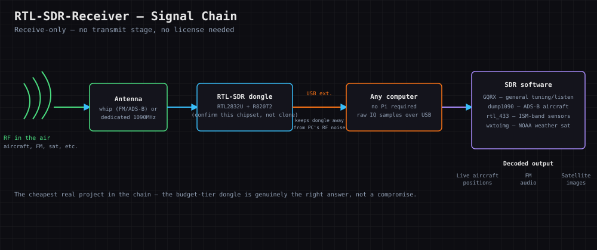

# RTL-SDR-Receiver

### A $30 USB dongle that receives real radio signals — decode aircraft transponders, weather satellite images, and FM radio. License-free, receive-only.

 [](LICENSE-GPL) [](LICENSE-AGPL)

[🎮 Interactive Tour](docs/interactive/index.html) · [📋 Cheat Sheet](docs/CHEATSHEET.pdf) · [📖 Full Lesson](docs/LESSON.pdf) · [🔗 Resources](docs/RESOURCES.pdf) · [📖 Lesson Plan](docs/LESSON_PLAN.md)

<!-- SCREENSHOT PLACEHOLDER: docs/screenshots/overview.png -->

Part of **Chain K — Hardware & Systems Foundations**. Shares RF/antenna fundamentals with
**Walkie-Talkie-Build** and **Cyberdeck-Cellular-And-Media**; the safest, cheapest entry point into RF
for anyone new to it.

## What this is

Software-defined radio turns "radio" from a sealed black box into something you can actually see: raw
RF comes in over USB, and software does the demodulation a dedicated chip would normally hide from
you. A receiver has no transmit stage, so there's no license or legal risk — just an antenna, a $30
dongle, and the actual radio spectrum around you. The four lessons build from the simplest possible
signal to two genuinely useful real-world ones: understand IQ sampling first, get FM broadcast working
with GQRX to confirm the whole signal chain, decode real aircraft ADS-B transponder messages with
`dump1090`, then receive an actual NOAA weather satellite image — where antenna choice, not software,
becomes the deciding factor. Practice real AM/FM demodulation math and manual ADS-B message decoding in
the **IQ & Demodulation Simulator** tab before you're troubleshooting against live RF with no reference
answer.

## Prerequisites

| Requirement | Notes |
|---|---|
| A modern browser | Chrome, Firefox, Safari, or Edge — the interactive tour is a single HTML file, no install |
| Python 3.8+ (for the exercises) | Check with `python3 --version` |
| An RTL-SDR dongle + antenna (optional for the tour/exercises) | Only needed for real reception — the tour and exercises need nothing but a browser and Python |

## Items Needed

- [ ] An RTL-SDR dongle — see [Hardware Buying Guide](#hardware-buying-guide-what-to-look-for--red-flags) below (RTL2832U + R820T2 chipset, not a generic TV tuner)
- [ ] A matched antenna — a basic telescopic whip to start; a dedicated 1090MHz or 137MHz antenna for ADS-B/APT specifically
- [ ] A USB extension cable (keeps the dongle away from the computer's own RF noise)
- [ ] Nothing else required for the tour or exercises — just a browser and Python

## Quick Start

1. **Open the interactive tour.** Double-click `docs/interactive/index.html` — no server, no build step.
2. **Work Lesson 1 (SDR fundamentals)**, then open the **IQ & Demodulation Simulator** tab and switch
   between AM and FM mode on the same synthetic tone.
3. **Do the skeleton-code exercise.**
   ```bash
   cd exercises
   python3 -m venv .venv && source .venv/bin/activate
   pip install pytest
   pytest -v
   ```
   You'll see 7 failing tests. Open `exercises/sdr_dsp.py` and implement the four functions — full
   instructions in [`exercises/README.md`](exercises/README.md).
4. **Work Lesson 2 (FM/AM & GQRX)** and, if you have hardware, tune to a strong local FM station.
   > ⚠️ **You may get stuck here:** if reception is weak or noisy at *every* frequency, that's almost
   > always USB port RF noise, not a bad antenna or a defective dongle. Try a USB extension cable
   > before touching anything else.
5. **Work Lesson 3 (ADS-B decoding)**, then use the Simulator's ADS-B decoder panel to check a raw
   message's Downlink Format and ICAO address against working through the bits by hand.
6. **Work Lesson 4 (APT weather sats & antennas).**
7. **Then the Quiz**, then Flashcards/Match/Pop Quiz for review.
8. **Check the Report Card tab** any time. Click **Print / Save as PDF** to keep a dated copy in `docs/`.

## Exercise Overview

| # | Lesson | Concept | IQ & Demodulation Simulator tie-in |
|---|---|---|---|
| 1 | SDR fundamentals | IQ samples, software-defined demodulation | AM/FM demodulator panel |
| 2 | FM/AM & GQRX | Waterfall, WFM mode, USB RF noise | *(hands-on with real hardware — no simulator panel)* |
| 3 | ADS-B decoding | Downlink Format, ICAO address, message structure | ADS-B message decoder panel |
| 4 | APT weather sats & antennas | Antenna matching, polarization | *(hands-on with real hardware — no simulator panel)* |

**Learning path:**
```
Lesson 1 (IQ fundamentals)  →  Lesson 2 (FM/GQRX)  →  Lesson 3 (ADS-B)  →  Lesson 4 (APT & antennas)
              ↓                                              ↓
   IQ Sim: AM/FM demodulator                        IQ Sim: ADS-B decoder
              ↓                                              ↓
                    exercises/ (sdr_dsp.py)
                                    ↓
                    Quiz → Flashcards/Match/Pop Quiz → Report Card
```

## Hardware Buying Guide (What to look for & red flags)

**Parts list:** an RTL-SDR dongle (the RTL2832U + R820T2 chipset combination is the de facto standard —
buy one explicitly sold as "RTL-SDR", not a cheap generic DVB-T TV tuner, which uses different tuner chips
with worse performance), a matched antenna (a basic telescopic whip covers FM/ADS-B reasonably; a dedicated
1090MHz antenna does ADS-B much better), and a USB extension cable (keeps the dongle away from computer
RF noise).

**What to look for:** buy from a vendor explicitly selling "RTL-SDR Blog" branded dongles or equivalent —
these are the ones the open-source SDR community actually tests against and documents. TCXO
(temperature-compensated crystal) versions drift less in frequency and are worth the small premium.

**Red flags:** unbranded "USB TV tuner" listings with no mention of RTL2832U/R820T2 — many are a different,
incompatible chipset despite looking identical in photos.

**Common failure points:** USB port RF noise swamping weak signals (the extension cable fixes this),
running an incompatible/generic dongle and blaming the software, and a whip antenna with no ground plane
underperforming badly indoors.

## Signal Chain Diagram

Not a wiring diagram in the usual sense — there's nothing to solder — but the same idea: antenna → dongle
→ computer over a USB extension (keeps the dongle away from the computer's own RF noise) → SDR software
does the actual demodulation:



## Parts & Pricing

Pulled from the chain-wide [Hardware Shopping List](../HARDWARE_SHOPPING_LIST.md#rtl-sdr-receiver) — check
there for current links; prices drift. **Budget/Mid/Luxury are the same tiers the shopping list calls
Budget/Mid/Premium.**

| Item | Budget | Mid | Luxury |
|---|---|---|---|
| Dongle | [RTL-SDR Blog V4, ~$30](https://www.amazon.com/RTL-SDR-Blog-RTL2832U-Software-Defined/dp/B0F6MQ5N5W) | Same dongle + antenna bundle, ~$40 | Same dongle + dedicated 1090MHz ADS-B antenna, ~$25–40 extra — serious aircraft tracking |
| USB extension | Any basic 3–6ft cable, ~$6–8 | Same | Same — not worth tiering |

Running total: **~$36–38 budget → ~$95–110 luxury**. This is genuinely the cheapest real project in the
whole chain — the budget tier is the correct answer here, not a compromise, per the buying guide above.

## Why This Matters (Industry Application)

RF/SDR skills are directly relevant to telecom, spectrum analysis, and security research (RF is a real
attack surface). It's also one of the fastest ways to make "invisible" infrastructure — flight tracking,
weather data, radio — visible and concrete.

## Topics Covered

| Area | What this project covers |
|------|--------------------------|
| SDR fundamentals | Sampling, IQ data, and demodulation basics |
| ADS-B | Decoding real aircraft transponder signals |
| APT/weather sats | Receiving and decoding NOAA satellite images |
| FM/AM | The simplest demodulation to start with |
| Antennas | Why a matched antenna changes everything |
| Tooling | GQRX, rtl_433, dump1090 and the SDR software ecosystem |

## How This Connects

Chain K (Hardware & Systems Foundations). Shares RF/antenna fundamentals with **Walkie-Talkie-Build**
and **Cyberdeck-Cellular-And-Media**; the safest, cheapest entry point into RF for anyone new to it.

## Project Layout

```
RTL-SDR-Receiver/
├── docs/
│   ├── interactive/index.html   # tour: lessons, quiz, flashcards, match, pop quiz, IQ/demod simulator, report card
│   ├── LESSON_PLAN.md           # short build-plan reference
│   ├── LESSON.pdf               # the full written lesson, printable
│   ├── CHEATSHEET.pdf           # one-page recap, printable
│   ├── RESOURCES.pdf            # further-reading links, printable
│   └── diagrams/wiring.svg      # signal chain diagram
├── exercises/
│   ├── sdr_dsp.py                # skeleton — implement the 4 functions
│   ├── test_sdr_dsp.py
│   └── README.md
└── README.md                    # this file
```

---
Dual licensed — [GPL v3](LICENSE-GPL) and [AGPL v3](LICENSE-AGPL).
